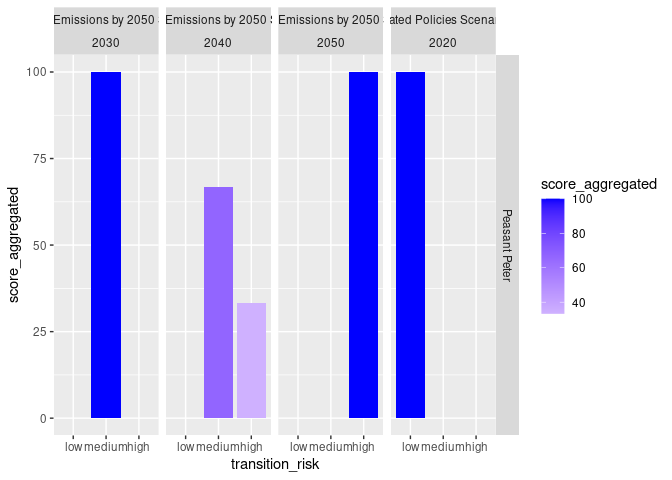

<!-- README.md is generated from README.Rmd. Please edit that file -->

# tiltIndicator

<!-- badges: start -->

[](https://lifecycle.r-lib.org/articles/stages.html#experimental)
[](https://github.com/2DegreesInvesting/tiltIndicator/actions/workflows/R-CMD-check.yaml)
[](https://app.codecov.io/gh/2DegreesInvesting/tiltIndicator?branch=main)
<!-- badges: end -->

The goal of tiltIndicator is to help you develop each TILT indicator.

This repository hosts only public code and may only show only fake data.

## Installation

You can install the development version of tiltIndicator from
[GitHub](https://github.com/) with:

``` r
# install.packages("devtools")
devtools::install_github("2DegreesInvesting/tiltIndicator")
```

## Example

``` r
library(tidyverse, warn.conflicts = FALSE)
#> ── Attaching packages ─────────────────────────────────────── tidyverse 1.3.2 ──
#> ✔ ggplot2 3.4.1     ✔ purrr   1.0.1
#> ✔ tibble  3.1.8     ✔ dplyr   1.1.0
#> ✔ tidyr   1.3.0     ✔ stringr 1.5.0
#> ✔ readr   2.1.4     ✔ forcats 1.0.0
#> ── Conflicts ────────────────────────────────────────── tidyverse_conflicts() ──
#> ✖ dplyr::filter() masks stats::filter()
#> ✖ dplyr::lag()    masks stats::lag()
library(tiltIndicator)
```

As a user you’ll need a good place to keep private data and an easy way
to access it.

``` r
with_scores <- companies |> 
  pstr_add_reductions(ep_weo, weo_2022) |> 
  pstr_add_transition_risk() |> 
  pstr_aggregate_scores()
#> Warning: Returning more (or less) than 1 row per `summarise()` group was deprecated in
#> dplyr 1.1.0.
#> ℹ Please use `reframe()` instead.
#> ℹ When switching from `summarise()` to `reframe()`, remember that `reframe()`
#>   always returns an ungrouped data frame and adjust accordingly.
#> ℹ The deprecated feature was likely used in the tiltIndicator package.
#>   Please report the issue to the authors.

with_scores
#> # A tibble: 19 × 5
#> # Groups:   company_name, transition_risk, scenario, year [19]
#>    company_name       transition_risk scenario                      year score…¹
#>    <chr>              <chr>           <chr>                        <dbl>   <dbl>
#>  1 John Meier's Cars  high            Net Zero Emissions by 2050 …  2040   100  
#>  2 John Meier's Cars  high            Net Zero Emissions by 2050 …  2050   100  
#>  3 John Meier's Cars  low             Stated Policies Scenario      2020   100  
#>  4 John Meier's Cars  medium          Net Zero Emissions by 2050 …  2030   100  
#>  5 Peasant Paul       no_sector       <NA>                            NA   100  
#>  6 Peasant Peter      high            Net Zero Emissions by 2050 …  2040    33.3
#>  7 Peasant Peter      high            Net Zero Emissions by 2050 …  2050   100  
#>  8 Peasant Peter      low             Stated Policies Scenario      2020   100  
#>  9 Peasant Peter      medium          Net Zero Emissions by 2050 …  2030   100  
#> 10 Peasant Peter      medium          Net Zero Emissions by 2050 …  2040    66.7
#> 11 Screwdriver Expert high            Net Zero Emissions by 2050 …  2050   100  
#> 12 Screwdriver Expert low             Stated Policies Scenario      2020   100  
#> 13 Screwdriver Expert medium          Net Zero Emissions by 2050 …  2030   100  
#> 14 Screwdriver Expert medium          Net Zero Emissions by 2050 …  2040   100  
#> 15 Tom's Car Company  high            Net Zero Emissions by 2050 …  2040    50  
#> 16 Tom's Car Company  high            Net Zero Emissions by 2050 …  2050   100  
#> 17 Tom's Car Company  low             Stated Policies Scenario      2020   100  
#> 18 Tom's Car Company  medium          Net Zero Emissions by 2050 …  2030   100  
#> 19 Tom's Car Company  medium          Net Zero Emissions by 2050 …  2040    50  
#> # … with abbreviated variable name ¹​score_aggregated

with_scores |> pstr_plot_company("Peasant Peter")
```



[CONTRIBUTING](https://github.com/2DegreesInvesting/tiltIndicator/blob/main/.github/CONTRIBUTING.md)
