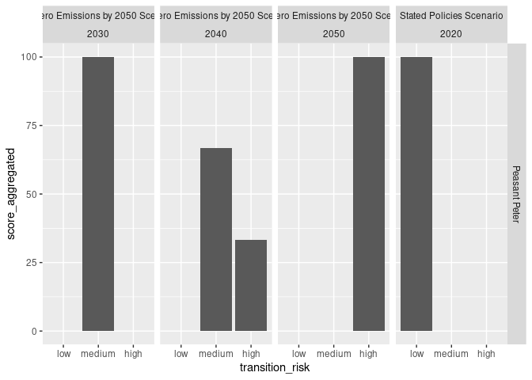

<!-- README.md is generated from README.Rmd. Please edit that file -->

# tiltIndicator

<!-- badges: start -->

[](https://lifecycle.r-lib.org/articles/stages.html#experimental)
[](https://github.com/2DegreesInvesting/tiltIndicator/actions/workflows/R-CMD-check.yaml)
[](https://app.codecov.io/gh/2DegreesInvesting/tiltIndicator?branch=main)
<!-- badges: end -->

The goal of tiltIndicator is to help you develop each TILT indicator.
This repository hosts only public code and data.

## Installation

You can install the development version of tiltIndicator from
[GitHub](https://github.com/) with:

``` r
# install.packages("devtools")
devtools::install_github("2DegreesInvesting/tiltIndicator")
```

## Example

``` r
library(tiltIndicator)
```

We’ll use datasets that come with the tiltIndicator package.

``` r
companies
#> # A tibble: 10 × 5
#>    company_id company_name       products              sector            subse…¹
#>         <dbl> <chr>              <chr>                 <chr>             <chr>  
#>  1          1 Peasant Peter      screws                steel_metal_tran… bendin…
#>  2          2 Peasant Peter      aluminium_alloy       steel_metals      alumin…
#>  3          3 Peasant Peter      ultrafilstration      cars              vehicl…
#>  4          4 Peasant Paul       frozen_food           frozen_food       cheese…
#>  5          5 Tom's Car Company  oils                  cars              automo…
#>  6          6 Tom's Car Company  bolts                 steel_metal_tran… bendin…
#>  7          7 Screwdriver Expert chucks                steel_metal_tran… boring…
#>  8          8 Screwdriver Expert adaptator_plate       steel_metal_tran… boring…
#>  9          9 John Meier's Cars  disinfection_products cars              vehicl…
#> 10         10 John Meier's Cars  ultrafilstration      cars              vehicl…
#> # … with abbreviated variable name ¹​subsector

ep_weo
#> # A tibble: 133 × 6
#>    EP_categories_id                      EP_gr…¹ EP_se…² EP_su…³ weo_p…⁴ weo_f…⁵
#>    <chr>                                 <chr>   <chr>   <chr>   <chr>   <chr>  
#>  1 d3a7a3c40afd18a7a840942262099f23f65c… metall… steel_… bendin… Total   Iron a…
#>  2 8d926b734410de5ba68daa17089a14c1bc1b… metall… steel_… boiler… Total   Iron a…
#>  3 2eed5a1fd604b1d3ec561a07257b8a1eb99f… metall… steel_… boring… Total   Iron a…
#>  4 157f4f5953d1a5bfee474217567dc2e65068… metall… steel_… brazin… Total   Iron a…
#>  5 2092de203e479b67bea02356318c0c8fc8e0… metall… steel_… broach… Total   Iron a…
#>  6 62dea331c70a02280d5f71a27ec140305aff… metall… steel_… bronzi… Total   Iron a…
#>  7 8c02cdfddde68d166c1352fa745df959f4ff… metall… steel_… canopi… Total   Iron a…
#>  8 e593b1156ce341881d18b82747a3c0bb490c… metall… steel_… chrome… Total   Iron a…
#>  9 b044eec1205c7ef2fde9e38db6b9b308a1bd… metall… steel_… cleani… Total   Iron a…
#> 10 0880f49af456479b3e4f99c1ed0d14217e26… metall… steel_… cuttin… Total   Iron a…
#> # … with 123 more rows, and abbreviated variable names ¹​EP_group, ²​EP_sector,
#> #   ³​EP_subsector, ⁴​weo_product_mapper, ⁵​weo_flow_mapper

weo_2022
#> # A tibble: 8 × 10
#>   publication    scena…¹ region categ…² product flow  unit   year  value reduc…³
#>   <chr>          <chr>   <chr>  <chr>   <chr>   <chr> <chr> <dbl>  <dbl>   <dbl>
#> 1 World Energy … Stated… world  co2 co… Total   Road… mt c…  2020 2.79e3     0  
#> 2 World Energy … Net Ze… world  co2 co… Total   Road… mt c…  2030 1.63e3    41.7
#> 3 World Energy … Net Ze… world  co2 co… Total   Road… mt c…  2040 5.47e2    80.4
#> 4 World Energy … Net Ze… world  co2 co… Total   Road… mt c…  2050 8.46e1    97.0
#> 5 World Energy … Stated… world  co2 co… Total   Iron… mt c…  2020 2.59e3     0  
#> 6 World Energy … Net Ze… world  co2 co… Total   Iron… mt c…  2030 1.95e2    31.4
#> 7 World Energy … Net Ze… world  co2 co… Total   Iron… mt c…  2040 1.01e4    66.9
#> 8 World Energy … Net Ze… world  co2 co… Total   Iron… mt c…  2050 7.43e3    91.5
#> # … with abbreviated variable names ¹​scenario, ²​category, ³​reductions
```

The `pstr_*()` functions help you work with the
product-sector-transition-risk indicator.

``` r
with_scores <- companies |>
  pstr_add_reductions(ep_weo, weo_2022) |>
  pstr_add_transition_risk() |>
  pstr_aggregate_scores()
#> Warning: Returning more (or less) than 1 row per `summarise()` group was deprecated in
#> dplyr 1.1.0.
#> ℹ Please use `reframe()` instead.
#> ℹ When switching from `summarise()` to `reframe()`, remember that `reframe()`
#>   always returns an ungrouped data frame and adjust accordingly.
#> ℹ The deprecated feature was likely used in the tiltIndicator package.
#>   Please report the issue at
#>   <]8;;https://github.com/2DegreesInvesting/tiltIndicator/issueshttps://github.com/2DegreesInvesting/tiltIndicator/issues]8;;>.

with_scores
#> # A tibble: 19 × 5
#> # Groups:   company_name, transition_risk, scenario, year [19]
#>    company_name       transition_risk scenario                      year score…¹
#>    <chr>              <chr>           <chr>                        <dbl>   <dbl>
#>  1 John Meier's Cars  high            Net Zero Emissions by 2050 …  2040   100  
#>  2 John Meier's Cars  high            Net Zero Emissions by 2050 …  2050   100  
#>  3 John Meier's Cars  low             Stated Policies Scenario      2020   100  
#>  4 John Meier's Cars  medium          Net Zero Emissions by 2050 …  2030   100  
#>  5 Peasant Paul       no_sector       <NA>                            NA   100  
#>  6 Peasant Peter      high            Net Zero Emissions by 2050 …  2040    33.3
#>  7 Peasant Peter      high            Net Zero Emissions by 2050 …  2050   100  
#>  8 Peasant Peter      low             Stated Policies Scenario      2020   100  
#>  9 Peasant Peter      medium          Net Zero Emissions by 2050 …  2030   100  
#> 10 Peasant Peter      medium          Net Zero Emissions by 2050 …  2040    66.7
#> 11 Screwdriver Expert high            Net Zero Emissions by 2050 …  2050   100  
#> 12 Screwdriver Expert low             Stated Policies Scenario      2020   100  
#> 13 Screwdriver Expert medium          Net Zero Emissions by 2050 …  2030   100  
#> 14 Screwdriver Expert medium          Net Zero Emissions by 2050 …  2040   100  
#> 15 Tom's Car Company  high            Net Zero Emissions by 2050 …  2040    50  
#> 16 Tom's Car Company  high            Net Zero Emissions by 2050 …  2050   100  
#> 17 Tom's Car Company  low             Stated Policies Scenario      2020   100  
#> 18 Tom's Car Company  medium          Net Zero Emissions by 2050 …  2030   100  
#> 19 Tom's Car Company  medium          Net Zero Emissions by 2050 …  2040    50  
#> # … with abbreviated variable name ¹​score_aggregated

with_scores |> pstr_plot_company("Peasant Peter")
```


